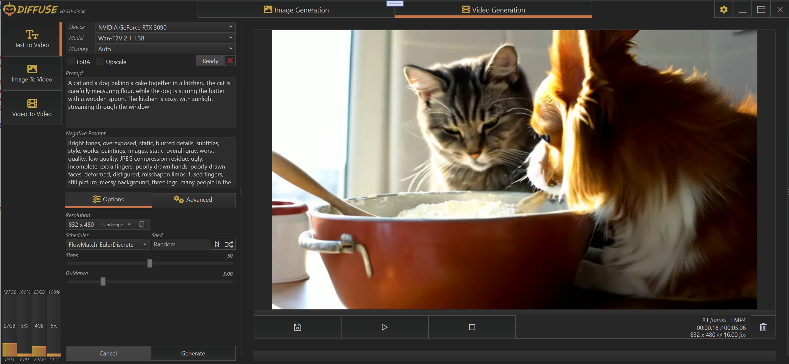

    

 

`Diffuse` is a Windows desktop UI for `Huggingface Diffusers`. It integrates directly with Python using the Python C API via `CSnakes`, enabling high-performance interop between .NET and Python for running diffusion models.

---

## Features
- Automatic installation of isolated portable Python
- Device-specific Python virtual environments
- Automatic model downloads from Huggingface repositories

---

## Supported Pipelines
**Z-Image**
- ZImagePipeline
- ZImageImg2ImgPipeline

**Qwen Image**
- QwenImagePipeline
- QwenImageImg2ImgPipeline
- QwenImageEditPlusPipeline

**FLUX.1**
- FluxPipeline
- FluxImg2ImgPipeline
- FluxKontextPipeline
- FluxControlNetPipeline

**FLUX.2**
- Flux2Pipeline

**Chroma**
- ChromaPipeline
- ChromaImg2ImgPipeline

**Wan Video**
- WanPipeline
- WanImageToVideoPipeline

**StableDiffusionXL**
- StableDiffusionXLPipeline
- StableDiffusionXLImg2ImgPipeline
- StableDiffusionXLControlNetPipeline
- StableDiffusionXLControlNetImg2ImgPipeline

---

## Installation

1. Download and extract **Diffuse.zip**  
   *A fast SSD with plenty of free space is recommended, as model downloads can be large.*

2. Run **Diffuse.exe**

3. Load a model  
   Diffuse will automatically:
   - Install an isolated portable Python runtime  
   - Create the required virtual environment  
   - Download the selected model from Hugging Face  

### First-run notice
On first launch or when loading a model for the first time, setup may take several minutes while Python, dependencies, and model files are downloaded and initialized. This is expected behavior.

No manual Python setup is required.

---

## Project Roadmap

### Alpha
Proof of concept, Focus on core functionality.
- Portable Python installation and management
- Device-specific virtual environments
- Minimal but functional Windows UI
- Basic Diffusers pipeline support

### Beta
Focus on usability, stability, and feature expansion.
- Fully isolated Python execution
- Installer and deployment tooling
- Advanced UI and workflow options
- ControlNet support
- Upscaling and interpolation support
- Extractor pipeline support
- Stability, performance, and reliability improvements

---

## Screenshots

### TextToImage

    

 

### ImageToImage

    

 

### ImageEdit

    

 

### ImageEdit-Multi

    

 

### TextToVideo

    

 

### ImageToVideo

    

 