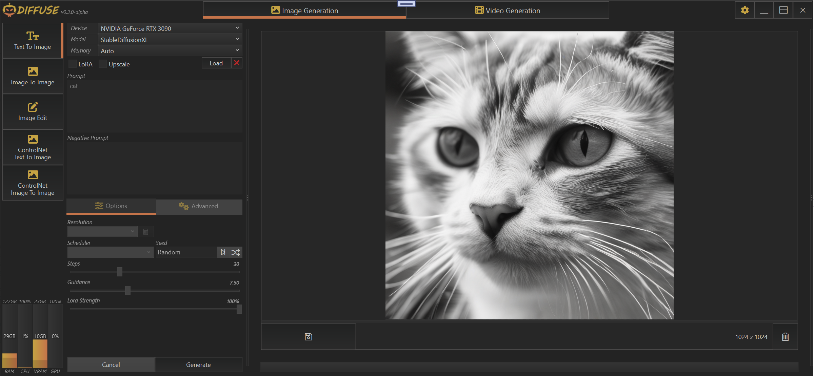
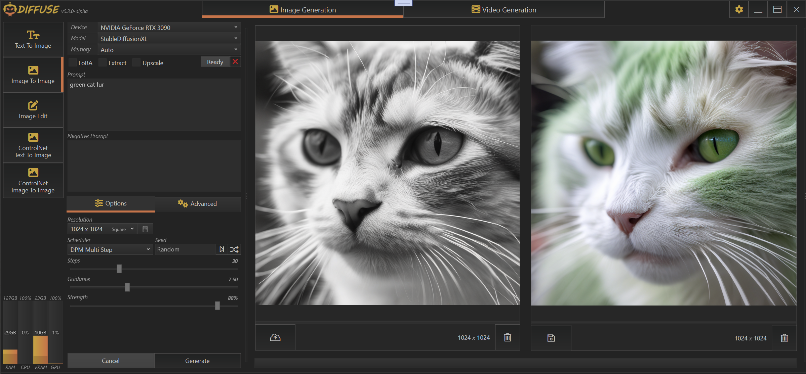
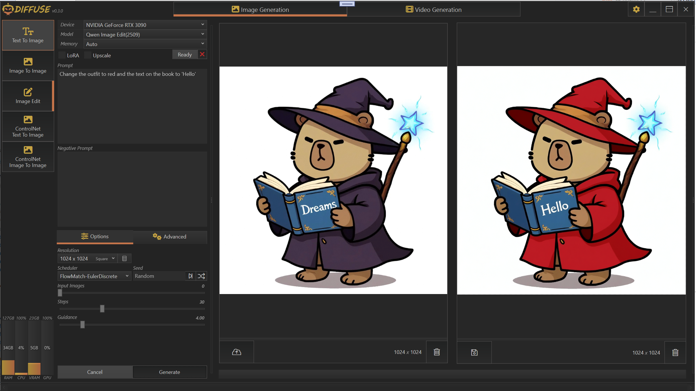

    

 

`Diffuse` is a Windows desktop UI for `Huggingface Diffusers`. It integrates directly with Python using the Python C API via `CSnakes`, enabling high-performance interop between .NET and Python for running diffusion models.

---

## Features
- Automatic installation of isolated portable Python
- Device-specific Python virtual environments
- Automatic model downloads from Huggingface repositories

## Supported Pipelines
### Z-Image
- ZImagePipeline
- ZImageImg2ImgPipeline
### Qwen Image
- QwenImagePipeline
- QwenImageImg2ImgPipeline
- QwenImageEditPlusPipeline
### FLUX.1
- FluxPipeline
- FluxImg2ImgPipeline
- FluxKontextPipeline
- FluxControlNetPipeline
### FLUX.2
- Flux2Pipeline
### Chroma
- ChromaPipeline
- ChromaImg2ImgPipeline
### Wan Video
- WanPipeline
- WanImageToVideoPipeline
### StableDiffusionXL
- StableDiffusionXLPipeline
- StableDiffusionXLImg2ImgPipeline
- StableDiffusionXLControlNetPipeline
- StableDiffusionXLControlNetImg2ImgPipeline

### TextToImage

    

 

### ImageToImage

    

 

### ImageEdit

    

 

### ImageEdit-Multi

    

 
