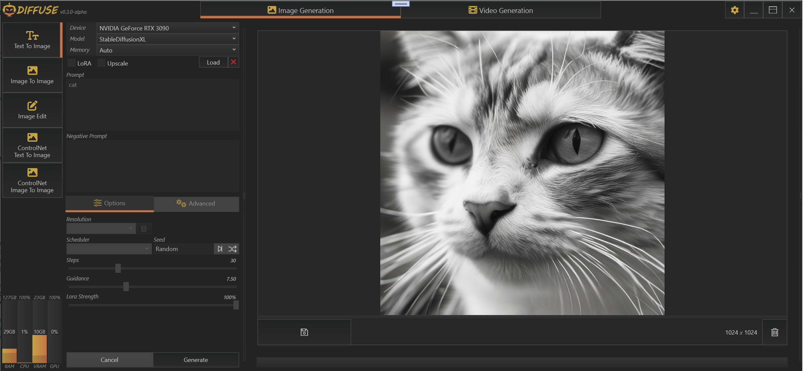
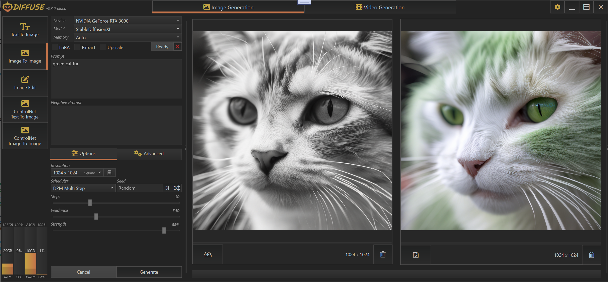
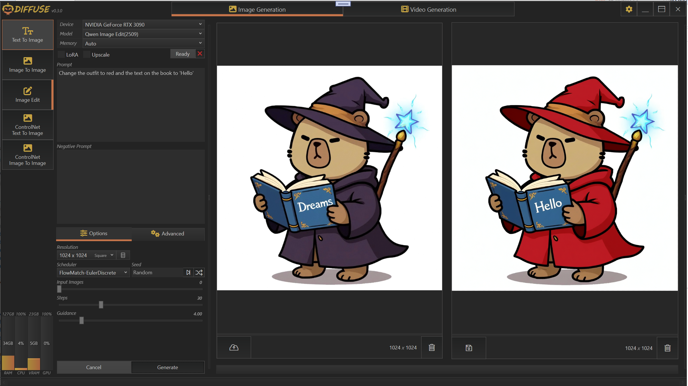
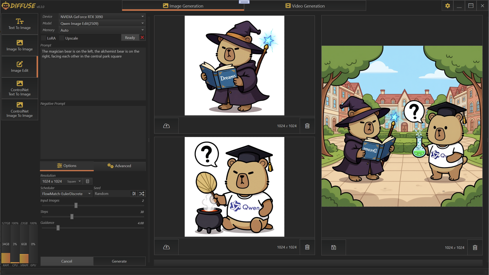
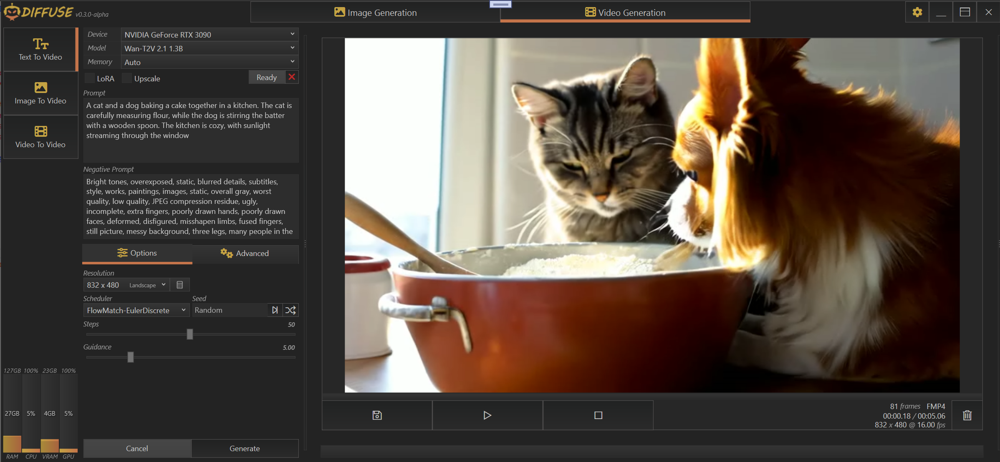
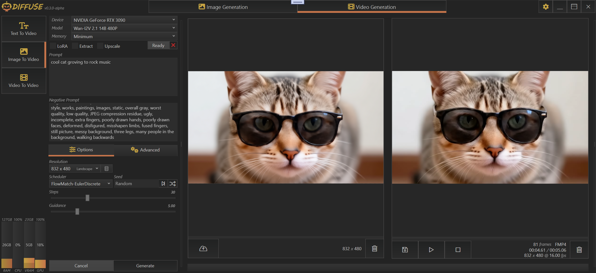

    

 

Diffuse is a Windows desktop UI for Huggingface [Diffusers](https://github.com/huggingface/diffusers). It integrates directly with Python using the Python C API via [CSnakes](https://github.com/tonybaloney/CSnakes), enabling high-performance interop between .NET and Python for running diffusion models.

---

## Features
- Automatic installation of isolated portable Python
- Device-specific Python virtual environments
- Automatic model downloads from Huggingface repositories
- Saftetensors, GGUF and ONNX support

---

## Supported Pipelines
- **Z-Image:** ZImagePipeline, ZImageImg2ImgPipeline, ZImageInpaintPipeline, ZImageControlNetPipeline
- **Qwen Image:** QwenImagePipeline, QwenImageImg2ImgPipeline, QwenImageEditPlusPipeline, QwenImageControlNetPipeline
- **FLUX.1:** FluxPipeline, FluxImg2ImgPipeline, FluxKontextPipeline, FluxControlNetPipeline
- **FLUX.2:** Flux2Pipeline, Flux2KleinPipeline
- **Chroma:** ChromaPipeline, ChromaImg2ImgPipeline
- **LTX Video:** LTXPipeline, LTXImageToVideoPipeline
- **LTX-2 Video:** LTX2Pipeline, LTX2ImageToVideoPipeline
- **Wan Video:** WanPipeline, WanImageToVideoPipeline
- **CogVideoX:** CogVideoXPipeline, CogVideoXImageToVideoPipeline, CogVideoXVideoToVideoPipeline
- **Kandinsky5:** Kandinsky5T2IPipeline, Kandinsky5I2IPipeline, Kandinsky5T2VPipeline, Kandinsky5I2VPipeline
- **StableDiffusionXL:** StableDiffusionXLPipeline, StableDiffusionXLImg2ImgPipeline, StableDiffusionXLControlNetPipeline, StableDiffusionXLControlNetImg2ImgPipeline
- **SkyReelsV2Pipeline:** SkyReelsV2DiffusionForcingPipeline, SkyReelsV2DiffusionForcingImageToVideoPipeline, SkyReelsV2DiffusionForcingVideoToVideoPipeline

---

## Installation & Upgrading

### 1. Installer Version
*Best for a standard Windows setup with automatic shortcuts.*

* **New Install & Upgrade:** 
    1. Download and run `Diffuse_vX.X.X.exe`.
    2. Follow the on-screen instructions.

---

### 2. Standalone Version
*Best for custom drive locations.*

**New Install:** 
1. Download and extract `Diffuse_vX.X.X.zip` to your preferred folder.
2. Run `Diffuse.exe`.

**Note:** A fast SSD with plenty of free space is highly recommended, as model downloads can be large.

**To Upgrade:** 
1. Download the new version.
2. Extract the contents.
3. Copy and overwrite all files into your existing Diffuse folder.

**Note:** Overwriting ensures your existing configurations and downloaded models remain intact while updating the core app.

---

### First-run Notice
On the first launch or when loading a model for the first time, setup may take several minutes while components are initialized. **This is expected behavior.**

Diffuse will automatically handle the following:
* **Portable Python:** Installs an isolated, portable Python runtime.
* **Environment:** Creates the required virtual environment.
* **Models:** Downloads the selected model files from Hugging Face.

No manual Python setup or coding knowledge is required.

---

### Device Support
Supports CUDA based devices

---

## Project Roadmap

### Alpha
Proof of concept, Focus on core functionality.
- ~~Portable Python installation and management~~
- ~~Device-specific virtual environments~~
- ~~Minimal but functional Windows UI~~
- ~~Basic Diffusers pipeline support~~

### Beta
Focus on usability, stability, and feature expansion.
- ~~Fully isolated Python execution~~
- ~~Multiple virtual environments~~
- ~~Installer and deployment tooling~~
- ~~Upscaling and interpolation support~~
- ~~Extractor pipeline support~~
- ~~ControlNet support~~
- ~~Inpaint/Outpaint processes~~
- ~~GGUF model support~~
- Advanced UI and workflow options
- Weighted prompt support
- Model Manager, download queuing, online templates
- ROCM Support
- Stability, performance, and reliability improvements

---

## Screenshots

### TextToImage

    

 

### ImageToImage

    

 

### ImageEdit

    

 

### ImageEdit-Multi

    

 

### TextToVideo

    

 

### ImageToVideo

    

 